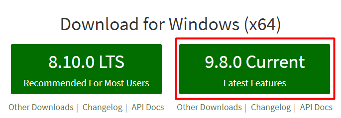

# AMCEF - workshop setup

- [AMCEF - workshop setup](#amcef---workshop-setup)
    - [Git](#git)
        - [Windows](#windows)
        - [Mac OS, Linux](#mac-os-linux)
    - [Node.js & NPM](#nodejs-npm)
## Git
Projekt, ktorý budeme vytvárať bude umiestnený v mojom verejnom repozitáry na Githube. Je preto nutné aby ste mali lokálne rozbehaný Git.
### Windows
Odporúčam oficiálny [git Bash](https://git-scm.com/downloads). Počas inštalácie ponechajte default nastavenia.
### Mac OS, Linux

## Node.js & NPM
Počas práce budeme používať NPM. NPM je súčasťou inštalácie Node.js, preto je nutné ho nainštalovať.
